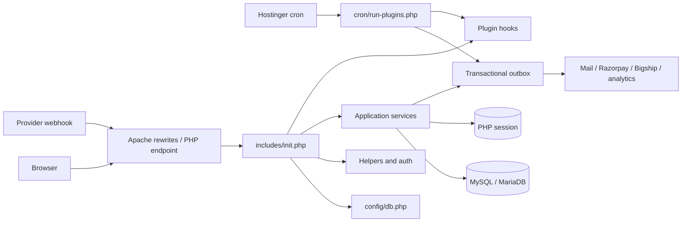
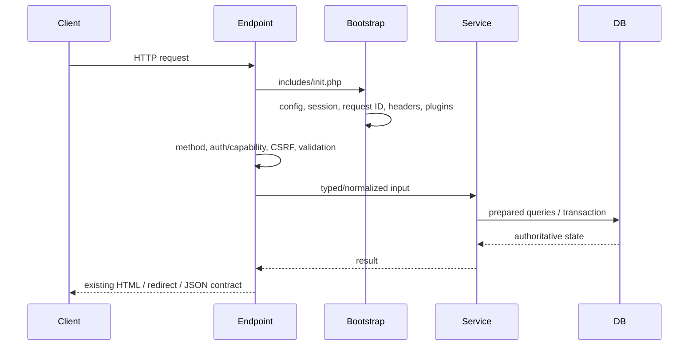
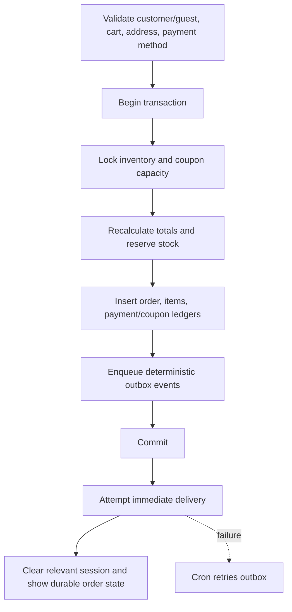

# Amber Fabrics architecture and modernization roadmap

This document defines the architecture direction for Amber Fabrics. It complements
[`repo-architecture.md`](repo-architecture.md), which records the current routes and
business-flow details. Modernization is incremental: public URLs, request fields,
response envelopes, redirects, hooks, session keys, and ecommerce state semantics
remain stable unless a separately reviewed change explicitly versions them.

## Architecture principles

1. PHP endpoints are delivery adapters. They authenticate, authorize, validate the
   request, call an application service, and render or redirect.
2. Services own business rules and transaction boundaries. Pages and plugins do not
   duplicate price, inventory, coupon, payment, or order-transition decisions.
3. MySQL is authoritative for durable commerce state. Sessions may cache a cart or
   navigation state, but never replace server-side order/payment verification.
4. Side effects are transactionally enqueued and delivered idempotently through the
   outbox. A mail, courier, analytics, or webhook failure cannot roll back a committed
   order in the browser.
5. Integrations sit behind provider adapters. Credentials, TLS policy, timeouts,
   retries, idempotency, and sanitized failures are server-side concerns.
6. Database changes run through immutable migrations or the explicitly invoked setup
   tool. Normal HTTP requests never create, alter, or repair schema.
7. Logs contain stable event names, a request/correlation ID, safe identifiers, and
   redacted context. Secrets, OTPs, tokens, cookies, signatures, payment details, and
   raw provider payloads are never logged.
8. Refactoring proceeds behind compatibility functions and existing hooks, with a
   focused contract test at every boundary.

## Current runtime



The application is a server-rendered PHP 8.2 system using strict `mysqli`, vanilla
JavaScript, and Bootstrap. There is no framework router, ORM, dependency-injection
container, or frontend build pipeline. Those are not defects by themselves; the main
constraint is maintaining clear boundaries within the existing deployment model.

## Target module boundaries

```text
endpoint / template
    -> authentication + authorization + CSRF + input mapping
    -> application service / command
        -> domain policy (order, inventory, price, coupon, payment)
        -> repository queries
        -> transaction + outbox enqueue
    -> stable HTML, redirect, or existing JSON envelope

plugin registration
    -> hook callback adapter
    -> application service or provider adapter
    -> no duplicated commerce transition rules
```

The target structure is evolutionary rather than a directory rewrite:

- `includes/services/`: application workflows and transaction ownership.
- `includes/domain/`: small pure policies introduced only when they remove duplicated
  rules, such as order lifecycle or money/status value objects.
- `includes/repositories/`: focused persistence adapters introduced when extracting
  SQL from large endpoints. Repositories do not commit transactions themselves.
- `includes/integrations/`: shared HTTP policy and provider clients, introduced behind
  the existing Razorpay, Bigship, Meta, and COD Guard interfaces.
- `includes/helpers/`: presentation and compatibility helpers only; no new business
  workflows.
- `includes/security/`: authentication/session helpers and request-facing security
  policies.
- `includes/presentation/`: shared display/context classes that do not mutate
  commerce state.
- `includes/views/layouts/`: storefront layout templates; the historical
  `includes/header.php` and `includes/footer.php` paths remain thin includes.
- `plugins/`: registration and feature adapters. Provider-specific modules can remain
  here when they are owned by one plugin.

No wholesale namespace or autoload migration is required. New classes should use the
project's existing explicit-loading convention until a separate Composer-autoload
change is justified and tested.

## Physical layout and public entry points

The repository is deployed directly under Hostinger's `public_html`, so document-root
PHP files such as `index.php`, `catalog.php`, `checkout.php`, `place-order.php`, and
payment/webhook entry points are intentionally kept at their current paths. Apache,
provider callbacks, forms, and existing bookmarks depend on those filenames. They are
delivery adapters, not misplaced library files, and moving them requires a separate
document-root/router deployment change.

Reusable implementation is organized below the blocked `includes/` tree:

```text
includes/
|-- domain/          pure commerce policies
|-- helpers/         compatibility and presentation functions
|-- integrations/    provider-independent HTTP boundaries
|-- presentation/    display metadata and site context
|-- security/        authentication and request security policies
|-- services/        application workflows and persistence operations
`-- views/layouts/   shared storefront layout templates
```

Legacy include paths for `SiteContext.php`, `customer-auth.php`,
`coupon-functions.php`, `header.php`, and `footer.php` remain deliberately as
three-line compatibility shims. Application bootstrap and first-party callers use the
organized implementation paths directly. The layout contract test protects both the
new ownership and the legacy paths.

## Request and response lifecycle



Every web response receives `X-Request-ID`. A syntactically safe inbound
`X-Request-ID` may be continued; otherwise the application generates 128 bits of
random identity. `app_log()` emits JSON context with this ID and recursively redacts
sensitive key names. Existing log sites can migrate to it incrementally.

JSON compatibility is deliberate. Existing endpoints use several established
envelopes (`success`, `ok`, and endpoint-specific data). They must not be silently
changed to a new universal envelope. New APIs should use `api_json()` and document a
consistent envelope; legacy endpoints should be normalized only through a versioned
contract or coordinated client migration.

## Commerce transaction boundaries

### Cart and checkout

- The browser/session cart is input, not an authority for price or availability.
- Checkout recalculates product prices, variants, quantities, discounts, tax,
  shipping, and payable total on the server.
- Shipping quote tokens are short-lived and validated before order creation.
- Client-submitted totals or payment status are never trusted.

### Order creation



All stock and coupon reservations belong to the same transaction as the order. The
outbox row is inserted before commit; external calls occur only after commit. Delivery
handlers use deterministic keys so callbacks, webhooks, immediate delivery, retries,
and cron cannot duplicate customer email, shipment creation, or analytics purchase.

### Payment verification

- Razorpay browser callbacks require the customer/order relationship and CSRF where
  applicable.
- Webhooks validate the raw-body signature before interpreting payload fields.
- Capture is accepted only after server-to-server verification of provider order,
  amount, currency, and captured state.
- Browser and webhook paths converge on the same idempotent payment transition and
  outbox event.
- Production cannot disable Razorpay or Bigship TLS certificate verification.
- Razorpay browser initialization keeps payment disabled until the nonce-bearing SDK is ready and exposes retry/return recovery when loading or opening fails. A provider API base override is permitted only for explicitly confirmed local/test E2E runs and loopback HTTP.

### Order lifecycle

The current transition map remains authoritative. A later extraction should move the
pure transition and presentation metadata from `InventoryService` to a focused
`OrderLifecycleService`, while retaining compatibility wrappers until all callers and
plugins migrate. Direct status writes outside that policy should be removed only with
tests proving cancellation, stock restoration, coupon release, refunds, COD, courier,
and return behavior.

## Authentication and authorization

- Customer and admin sessions remain isolated; admin cookies are scoped to `/admin`.
- Session cookies are strict, HTTP-only, SameSite, secure on HTTPS, and governed by
  idle/absolute lifetimes and authentication-version checks.
- Admin OTP issuance and verification remain transactional and rate-limited.
- Capabilities are enforced in handlers, never only in navigation or JavaScript.
- Browser mutations enforce the intended method and CSRF. Provider callbacks use
  signatures or configured shared secrets instead of CSRF.
- Guest order access uses expiring, hashed, database-backed tokens.

## Database and migration policy

- `database/migrations/*.sql` are immutable once deployed.
- `database/migrate.php` verifies SHA-256 checksums and records each migration.
- `database/schema.sql` describes a fully migrated fresh database and baselines every
  migration checksum.
- `database/setup.php` is CLI-only setup/repair code. It may inspect and alter schema
  because the operator invokes it explicitly; request handlers may not.
- The 2026-08-25 migration safely adds `categories.uses_variant_size` only when it is
  missing. This accommodates installations where the former Categories page already
  created the column.

Future schema changes must define rollback or forward-recovery guidance. Destructive
column/table changes require backups, a data-preservation step, and a separate operator
approval.

## Integration and failure policy

Provider clients must converge on these rules without changing their public adapters:

- HTTPS base URLs and provider-host validation;
- certificate and host verification mandatory in production;
- bounded connect and total timeouts;
- retries only for safe/idempotent requests or requests protected by an idempotency
  key;
- exponential or documented bounded backoff;
- normalized internal result (`ok`, status, safe error code, duration, retryability);
- no raw credentials, authorization headers, personal data, or full payloads in logs.

SSRF hardening should be provider-specific: compare resolved request hosts to the
configured provider base host, reject userinfo/fragments and non-HTTPS production URLs,
and never expose a generic arbitrary-URL fetcher to request data.

## Upload policy

Current upload endpoints validate size, extension, MIME, and—in image paths—image
structure. Consolidation should retain current request fields and stored paths while
moving policy into one service:

- generate server-side random names;
- normalize/allowlist extensions and inspect MIME from file content;
- re-encode raster images where the current feature permits it;
- verify the resolved destination remains under the intended upload root;
- keep private documents outside the public web root;
- serve public upload directories with script execution disabled;
- delete only validated basenames or database-owned paths.

## Performance strategy

Measure before changing behavior. The next useful instrumentation is route duration,
query count/slow-query sampling, outbox lag, external-call duration, and memory peak,
all correlated by request ID. Priority optimizations are:

1. eliminate request-time maintenance work and unbounded scans;
2. extract repeated route queries so indexes and query shapes are reviewable;
3. load plugins lazily where registration metadata proves a request cannot use them;
4. preserve keyset pagination and add composite indexes only from measured query plans;
5. use versioned browser caching for static assets and verify OPcache on production;
6. resize/compress images during controlled upload processing rather than requests.

## Incremental migration sequence

### Completed foundation

- Transactional outbox, retries, and readiness health.
- Concurrency-safe OTP and customer/coupon/payment hardening.
- Shipping plugin decomposition with compatibility entry points.
- Shared accessible confirmation/toast interaction layer.
- Request-time category DDL removal and idempotent migration.
- Production Razorpay TLS fail-closed policy.
- Request ID and redacted structured logging foundation.
- Order transition policy, online payment preference normalization, commerce status presentation, and external-link validation extracted from `InventoryService`; its original methods remain compatibility wrappers.
- Shared provider HTTP policy and JSON client now enforce methods, trusted hosts, production HTTPS, TLS verification, timeouts, and safe error metadata for Razorpay, Bigship, Meta CAPI, and COD Guard.
- Central upload policy now owns extension/MIME/content/size checks, generated target containment, upload moves, and safe stored-file deletion for admin media, product variants, branding, returns, and courier documents.
- Customer credential verification, login cart/wishlist merging, customer profile/address mutations, and category administration have moved into focused services; the endpoint files retain request validation, CSRF, sessions, flashes, and redirects.
- Checkout request normalization and validation now live in a pure domain policy; customer/order prefill and saved-address selection use a checkout read service; locked product snapshots and inclusive-GST allocation use focused order/pricing services. `place-order.php` still owns the transaction, coupon reservation, inventory reservation, outbox enqueue, commit, and final redirect decisions.
- Order, order-item, delivery-estimate, initial-payment, zero-amount confirmation, and quoted-shipment SQL now live in the transaction-neutral `OrderPersistenceService`. `place-order.php` remains the transaction coordinator and preserves the original operation ordering and compatibility paths for older schemas.
- Coupon normalization, validation, identity hashing, locked checkout resolution, capacity reservation, and idempotent release now live in transaction-neutral `CouponService`. Existing global coupon functions remain compatibility wrappers for payment, cancellation, webhook, cron, and tooling callers; `place-order.php` retains transaction ordering without owning SQL.
- Repeated customer, guest, and admin order-detail reads now use `OrderReadService`; ownership predicates, guest token grants, and `require_admin()` remain at their original access boundaries. Shared product unit/analytics/detail reads and customer contact/identity/email reads use focused read services.
- Application callers now use `CommercePresenter` and `ExternalUrlPolicy` directly. `InventoryService` retains its original presentation and URL compatibility wrappers for extensions that have not migrated.
- Storefront layouts, customer session authentication, site context, and coupon
  compatibility functions now live in `includes/views/layouts/`,
  `includes/security/`, `includes/presentation/`, and `includes/helpers/`
  respectively. Their historical include filenames remain thin compatibility shims,
  and document-root route files remain stable for Hostinger deployment.

### Bounded structural roadmap complete

No further source extraction is scheduled without measured duplication, query plans,
or a concrete feature need. New work should use the established domain, read,
persistence, integration, security, and presentation boundaries instead of adding
another general-purpose layer.

### Later: measured cleanup

- Repository interfaces only if multiple implementations or database-test substitution becomes necessary.
- Versioned API-envelope normalization if browser consumers are migrated together.
- Plugin lazy loading based on profiling.
- Composer autoload/namespaces if they reduce real maintenance cost.
- Expanded disposable-MySQL concurrency and courier sandbox coverage.
- Guarded browser commerce, accessibility, local Razorpay initialization, missing-media,
  Bootstrap-degradation, and courier failure-injection suites run without live providers.

## Change checklist

Before merging a modernization increment:

1. Confirm public fields, URLs, redirects, JSON keys/statuses, sessions, hooks, and
   database state semantics are unchanged or explicitly versioned.
2. Keep transaction ownership in one service and enqueue side effects before commit.
3. Add a dated migration and align schema/setup for every schema change.
4. Add source contracts and disposable-database tests proportional to concurrency risk.
5. Lint changed PHP, run focused tests, then the complete Composer suite.
6. Exercise affected flows at desktop and mobile widths when presentation changes.
7. Review the diff for secrets, logs, generated feeds, uploads, exports, or unrelated
   worktree changes.
8. Deploy configuration, migration, code, readiness check, and cron changes in the
   documented order; never run production migration commands automatically.
